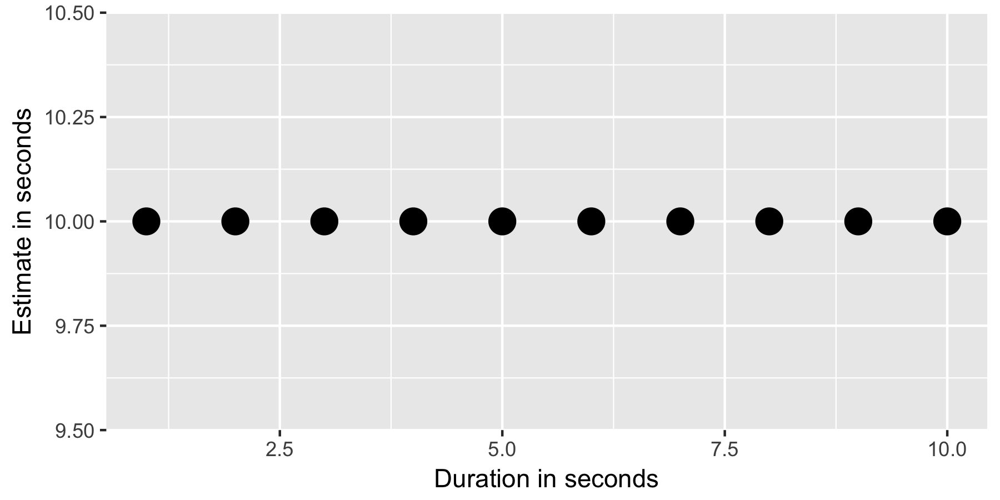
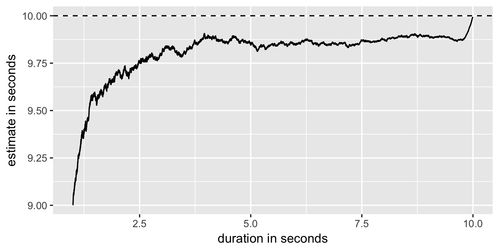

In exploring `async/await`, I wanted to see how consistently they behave. In this simulation. I fired off 20,000 `async` functions using [`Promise.all`](https://developer.mozilla.org/en-US/docs/Web/JavaScript/Reference/Global_Objects/Promise/all). There is no reason to assume that any of these functions any more quickly than the others, so we, in theory could predict how long a whole simulation is going to take based on just a few iterations (eg. extrapolating). A pseudocode implementation would be as follows:

```
start = now()
total = 10

for i from 1 to 10:
  // something that takes 1 second
  left = total - i
  soFar = now() - start
  pace = soFar / i
  estimate = pace * left
```

This, unsuprisingly, would mean that your estimates vs. duration plot would look like this:



This, for whatever reason is distinctly **not** the case. Here is the plot of estimate vs duration during the [`Promise.all` script](promises.js).



Clearly the estimates are pretty good, getting within `.8` seconds of the truth after just 1 second of "training", but the behavior is also pretty clearly inconsistent, jittering around a lot.
